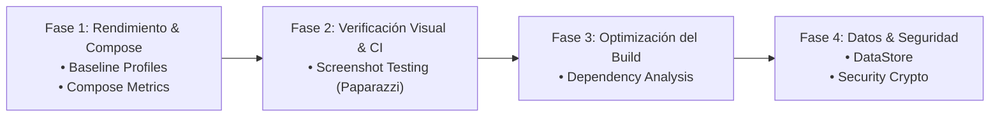

# Roadmap de Evolución de Plugins para PluginKit

Este documento traza la hoja de ruta para la incorporación de nuevos **Convention Plugins** en **PluginKit**, inspirados en las mejores prácticas de la industria Android (*Now in Android*, *Cash App*, *Slack*, *Dropbox*).

---

## 🎯 Visión General

El objetivo es transformar **PluginKit** en un ecosistema integral que no solo resuelva dependencias y compilación básica, sino que abarque:
* **Rendimiento de Aplicaciones** (Arranque, rendering y estabilidad de Compose).
* **Calidad y Verificación Visual** (Screenshot testing sin emulador).
* **Salud del Build Multi-Módulo** (Análisis de dependencias redundantes).
* **Seguridad y Persistencia Moderna** (Criptografía y DataStore).

---

## 🗺️ Fases del Roadmap

---

## Detalle de Plugins por Fase

### Fase 1: Rendimiento y Eficiencia en Runtime

#### 1. `pluginkit.android.baselineprofile`
* **Propósito**: Automatizar la configuración del plugin oficial de Baseline Profiles de Google (`androidx.baselineprofile`) y su integración con Macrobenchmark.
* **Beneficios**:
  * Reduce el tiempo de arranque de la app entre un 30% y un 40%.
  * Disminuye la tasa de *frame drops* (jank) en la primera interacción.
* **Componentes que configurará**:
  * Aplicación del plugin `androidx.baselineprofile`.
  * Inyección automática de `androidx.benchmark.macro` y dependencias de testing.
  * Reglas para asociar el módulo generador con el módulo de app (`showcase`).

#### 2. `pluginkit.android.compose.metrics`
* **Propósito**: Inyectar las banderas del compilador de Kotlin/Compose para generar informes detallados de estabilidad de composables.
* **Beneficios**:
  * Identifica clases inestables (*unstable params*) que provocan recomposiciones innecesarias.
  * Genera métricas cuantitativas (`compose_metrics.txt`) para auditorías de rendimiento.
* **Configuración del Plugin**:
  * Habilita `metricsDestination` y `reportsDestination` en tareas de compilación Kotlin.

---

### Fase 2: Calidad y Pruebas Visuales (Screenshot Testing)

#### 3. `pluginkit.android.screenshot.testing`
* **Propósito**: Estandarizar la suite de pruebas de capturas de pantalla sobre componentes y pantallas de Jetpack Compose (ej. vía **Paparazzi** de Cash App o el sistema nativo de Android Gradle Plugin).
* **Beneficios**:
  * Pruebas de regresión visual deterministas.
  * Se ejecutan en la **JVM estándar** en milisegundos, sin necesidad de emuladores ni dispositivos físicos en GitHub Actions.
* **Componentes que configurará**:
  * Tareas `./gradlew recordPaparazziDebug` y `./gradlew verifyPaparazziDebug`.
  * Configuración de fuentes y renderizado headless en CI.

---

### Fase 3: Salud del Grafo de Dependencias y Tiempos de Build

#### 4. `pluginkit.build.analysis`
* **Propósito**: Integrar el analizador de dependencias autónomo (`com.autonomousapps.dependency-analysis`).
* **Beneficios**:
  * Detecta dependencias no utilizadas (*unused dependencies*) que engordan el classpath.
  * Alerta sobre dependencias declaradas en `api` que deberían ser `implementation` (reduciendo la cascada de recompilación).
  * Previene el inflado del tamaño del APK final.
* **Configuración del Plugin**:
  * Generación de reportes automáticos en `./gradlew buildHealth`.

---

### Fase 4: Persistencia Moderna y Seguridad

#### 5. `pluginkit.android.datastore`
* **Propósito**: Configurar la persistencia de preferencias de usuario y datos clave-valor moderna.
* **Beneficios**:
  * Estandariza la migración de `SharedPreferences` obsoletos hacia Jetpack DataStore reactivo (Flow / Coroutines).
* **Inyección Automática**:
  * `androidx.datastore:datastore-preferences`
  * `androidx.datastore:datastore` (Proto DataStore con Kotlinx Serialization).

#### 6. `pluginkit.android.security`
* **Propósito**: Configurar librerías criptográficas de alto nivel recomendadas por Google.
* **Beneficios**:
  * Encriptación estándar de almacenamiento local y tokens de sesión.
* **Inyección Automática**:
  * `com.google.crypto.tink:tink-android`
  * `androidx.security:security-crypto`

---

## 📊 Matriz de Prioridad e Impacto

| Plugin Propuesto | Fase | Impacto en el Proyecto | Esfuerzo de Implementación |
| :--- | :---: | :---: | :---: |
| `pluginkit.android.baselineprofile` | 1 | 🔴 Muy Alto (Runtime Performance) | Medio |
| `pluginkit.android.compose.metrics` | 1 | 🟠 Alto (Optimización de UI) | Bajo |
| `pluginkit.android.screenshot.testing` | 2 | 🔴 Muy Alto (Testing Visual en CI) | Medio |
| `pluginkit.build.analysis` | 3 | 🟠 Alto (Build Performance) | Bajo |
| `pluginkit.android.datastore` | 4 | 🟡 Medio (Estandarización de Datos) | Bajo |
| `pluginkit.android.security` | 4 | 🟡 Medio (Seguridad Local) | Bajo |

---

## 📌 Próximos Pasos Sugeridos
1. **Paso Inicial Recomendado**: Iniciar con **Fase 1 (`compose.metrics` y `baselineprofile`)**, ya que el proyecto ya cuenta con el módulo `showcase` con Jetpack Compose y Hilt completamente funcional para demostrar su impacto.
